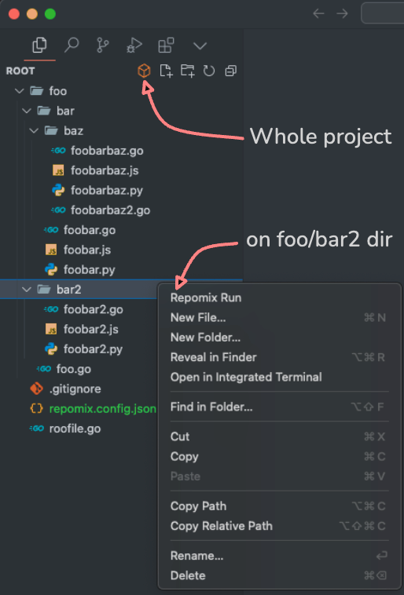
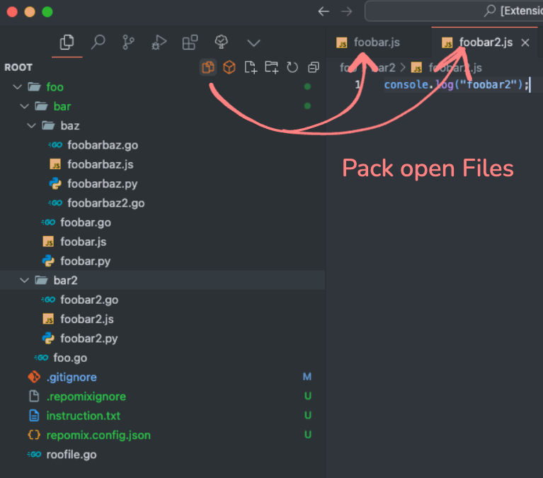
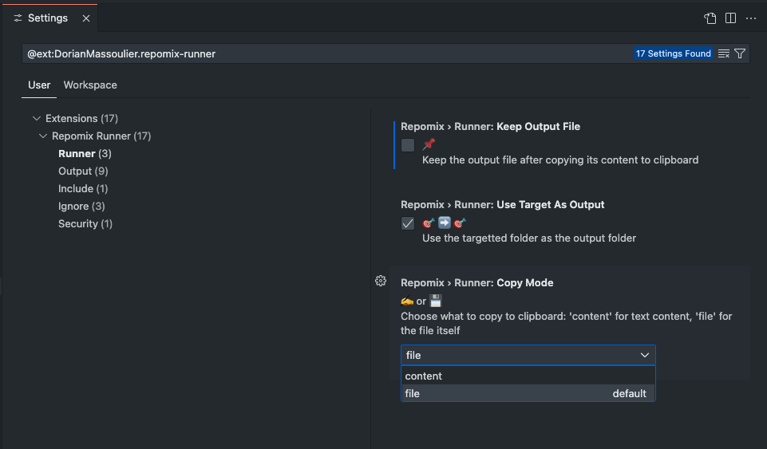
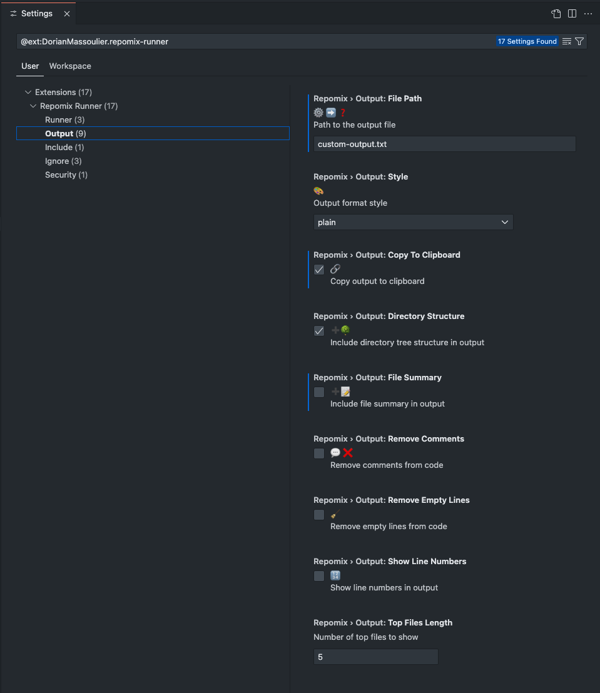
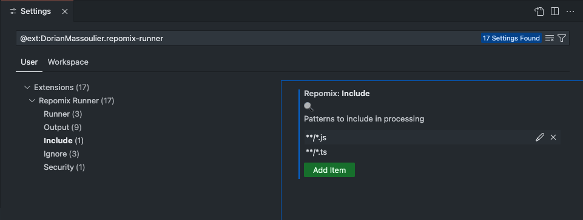
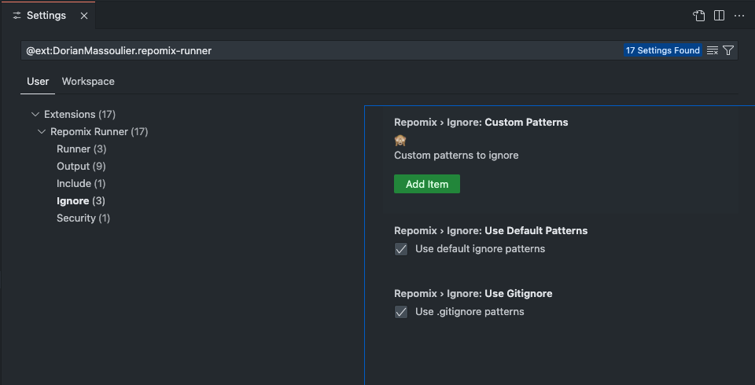
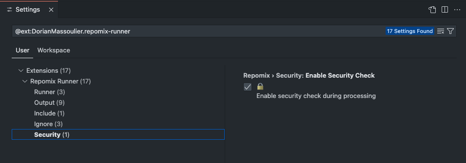

  

# Repomix Runner

Repomix Runner is a VS Code extension that runs the [Repomix](https://github.com/yamadashy/repomix) command line tool.

## ✨ Features

- 📁 Run Repomix on any folder easily.
- 🗑️ Optional output file cleanup. -> But you still have it in clipboard.
- 🔄 Two copy modes: content or file. -> you can paste a whole file not just content.
- 🛠️ easy settings in vscode and/or support a repomix.config.json file.

## 📖 Usage

- To pack the whole project, click on the square icon  or run the `Repomix Run` command.

- To pack the open files, click on the files icon  or run the `Repomix Run On Open Files` command.

- To pack a specific folder right-click on any folder in VS Code's explorer and select "Run Repomix" from the context menu.

  
  

And you can use the convenient commands to access settings and output ⬇️

## ⚙️ Commands

Open the palette with `Cmd+Shift+P` or `Ctrl+Shift+P` then:

- `Repomix Run` to run repomix on the root folder of your project
- `Repomix Run On Open Files` to run repomix on the open files
- `Repomix Settings` for a quick access to the settings
- `Repomix Output` to open the repomix output channel

## 🚀 Installation

1. Open VS Code
2. Press `Cmd+P` (macOS) or `Ctrl+P` (Windows/Linux)
3. Type `ext install DorianMassoulier.repomix-runner`
4. Press Enter

## 🛠️ Configuration

We added 3 new Runner settings on top of repomix settings (output, include, ignore, security)

#### Runner settings

  

#### Ouput settings

  

#### Include settings

  

#### Ignore settings

  

#### Security settings

  

- you can also add a repomix.config.json file in your project root folder, it will **_override_** the settings in the extension. Except for the runner settings.

## 📋 Requirements

- VS Code 1.93.0 or higher
- Node.js and npm installed (for `npx`)
- macOS for file copy mode
- xclip installed for file copy mode on linux

## ⚠️ Known Issues

- File copy mode is only available on macOS and linux (you need to install xclip for file copy mode on linux)

## 🤝 Contributing

Any feedback, issue or feature request is much appreciated !

## 📝 License

This project is licensed under the MIT License - see the [LICENSE.md](LICENSE.md) file for details.

---

**Note**: This extension is not affiliated with or endorsed by Repomix.
